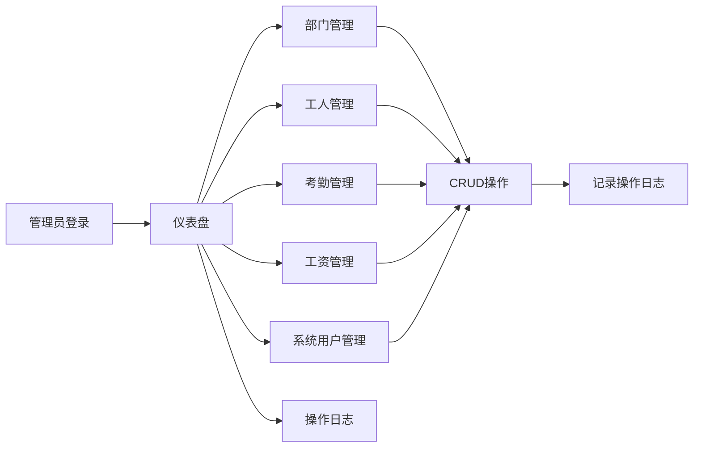
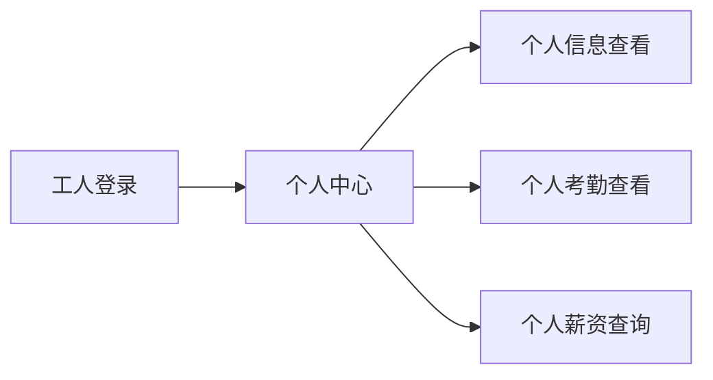

## 1. 产品概述

工人管理系统是一套面向企业的综合人力资源管理平台，旨在解决部门、工人、考勤、工资等核心业务的信息化管理问题。系统面向管理员和工人两类用户角色，提供完整的CRUD操作和个人信息查询功能。

- 主要目标：实现企业工人信息的数字化管理，提升人力资源管理效率
- 目标用户：企业管理员、工人
- 核心价值：规范化管理流程，数据实时可查，降低管理成本

## 2. 核心功能

### 2.1 用户角色

| 角色 | 登录方式 | 核心权限 |
|------|----------|----------|
| 管理员 | 账号密码登录 | 部门、工人、考勤、工资、系统用户的完整CRUD权限，操作日志查看 |
| 工人 | 账号密码登录 | 个人信息查看、个人考勤查看、个人薪资查询 |

### 2.2 功能模块

1. **部门管理**：部门信息的增删改查
2. **工人管理**：工人信息新增、修改、删除、查询，个人信息查看
3. **考勤管理**：考勤录入、统计、查询，个人考勤查看
4. **工资管理**：工资核算、发放管理，个人薪资查询
5. **系统用户管理**：账号新增、权限分配、账号管理
6. **操作日志**：操作记录查询、安全审计

### 2.3 页面详情

| 页面名称 | 模块名称 | 功能描述 |
|----------|----------|----------|
| 仪表盘 | 数据概览 | 展示部门数量、工人总数、本月考勤率、工资发放统计等关键指标 |
| 部门管理 | 部门列表 | 部门信息CRUD，支持搜索、分页 |
| 工人管理 | 工人列表 | 工人信息CRUD，支持按部门、姓名搜索，分页展示 |
| 考勤管理 | 考勤列表 | 考勤录入、统计查询，支持按日期、部门、工人筛选 |
| 工资管理 | 工资列表 | 工资核算、发放管理，支持按月份、部门、工人筛选 |
| 系统用户 | 用户列表 | 账号管理、权限分配，支持角色筛选 |
| 操作日志 | 日志列表 | 操作记录查询，支持按时间、操作人、操作类型筛选 |

## 3. 核心流程

### 管理员核心流程
管理员登录系统后，可通过侧边栏导航进入各个管理模块，进行数据的增删改查操作。所有操作都会记录到操作日志中，便于审计追踪。

### 工人核心流程
工人登录系统后，仅可查看个人相关信息，包括个人资料、个人考勤记录、个人工资明细。

## 4. 用户界面设计

### 4.1 设计风格
- 主色调：深蓝色 (#1e40af)，体现专业、稳重的企业管理风格
- 辅助色：绿色 (#10b981) 表示正常状态，红色 (#ef4444) 表示警告/删除
- 按钮风格：圆角矩形，悬停有轻微上浮效果
- 字体：使用系统无衬线字体，清晰易读
- 布局风格：左侧固定侧边栏 + 顶部导航栏 + 主内容区
- 图标：使用Element Plus内置图标库

### 4.2 页面设计概述

| 页面名称 | 模块名称 | UI元素 |
|----------|----------|--------|
| 仪表盘 | 数据概览 | 统计卡片、数据图表、快捷入口 |
| 部门管理 | 部门列表 | 搜索栏、新增按钮、数据表格、分页器 |
| 工人管理 | 工人列表 | 搜索栏（多条件）、新增按钮、数据表格、分页器 |
| 考勤管理 | 考勤列表 | 日期选择器、筛选条件、数据表格、统计信息 |
| 工资管理 | 工资列表 | 月份选择、筛选条件、数据表格、工资条详情 |
| 系统用户 | 用户列表 | 搜索栏、新增按钮、角色标签、数据表格 |
| 操作日志 | 日志列表 | 时间筛选、操作类型筛选、数据表格、详情弹窗 |

### 4.3 响应性
- 采用桌面优先设计，最低支持1366×768分辨率
- 侧边栏可折叠，适应不同屏幕宽度
- 表格支持横向滚动，确保数据完整性
- 移动端可通过折叠菜单进行基础操作

### 4.4 交互体验
- 表格行悬停高亮，提升可读性
- 表单提交前进行前端验证
- 操作成功/失败给予明确的消息提示
- 危险操作（如删除）需要二次确认
- 加载状态使用骨架屏或加载动画
