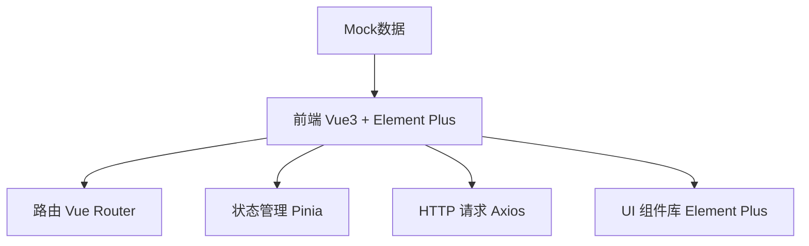
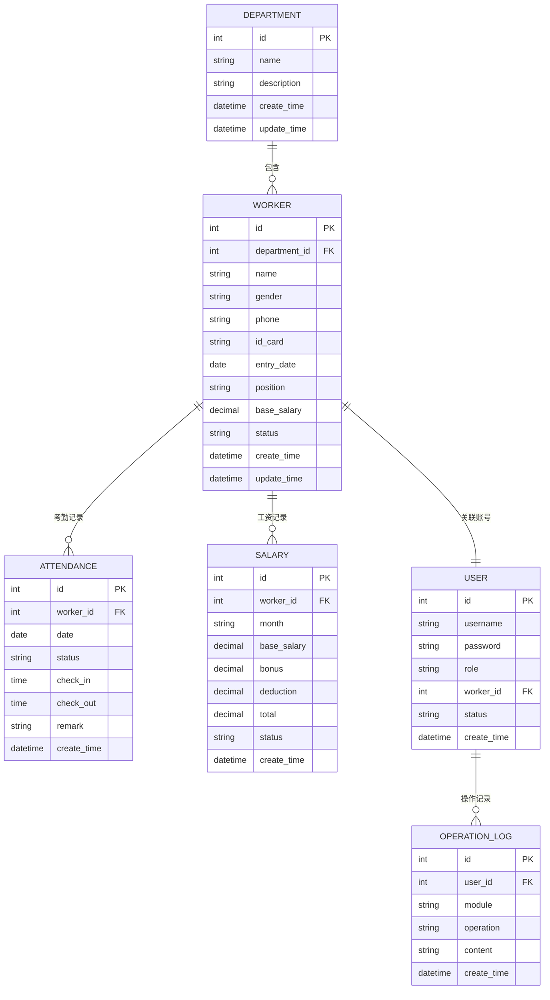

## 1. 架构设计



## 2. 技术描述

- 前端：Vue 3 + TypeScript + Vite
- UI组件库：Element Plus
- 路由：Vue Router 4
- 状态管理：Pinia
- HTTP客户端：Axios（预留，当前使用Mock数据）
- 构建工具：Vite

## 3. 路由定义

| 路由 | 页面 | 说明 |
|------|------|------|
| /login | 登录页 | 管理员/工人登录入口 |
| /dashboard | 仪表盘 | 数据概览、统计卡片 |
| /department | 部门管理 | 部门信息CRUD |
| /worker | 工人管理 | 工人信息CRUD |
| /attendance | 考勤管理 | 考勤录入、统计查询 |
| /salary | 工资管理 | 工资核算、发放管理 |
| /system/user | 系统用户 | 账号管理、权限分配 |
| /system/log | 操作日志 | 操作记录查询 |
| /profile | 个人中心 | 个人信息、考勤、薪资查看 |

## 4. 数据模型

### 4.1 ER图



### 4.2 数据字典

#### 部门表 (department)
| 字段 | 类型 | 说明 |
|------|------|------|
| id | number | 主键ID |
| name | string | 部门名称 |
| description | string | 部门描述 |
| createTime | string | 创建时间 |
| updateTime | string | 更新时间 |

#### 工人表 (worker)
| 字段 | 类型 | 说明 |
|------|------|------|
| id | number | 主键ID |
| departmentId | number | 部门ID |
| departmentName | string | 部门名称（冗余） |
| name | string | 姓名 |
| gender | string | 性别（男/女） |
| phone | string | 手机号 |
| idCard | string | 身份证号 |
| entryDate | string | 入职日期 |
| position | string | 职位 |
| baseSalary | number | 基本工资 |
| status | string | 状态（在职/离职） |
| createTime | string | 创建时间 |
| updateTime | string | 更新时间 |

#### 考勤表 (attendance)
| 字段 | 类型 | 说明 |
|------|------|------|
| id | number | 主键ID |
| workerId | number | 工人ID |
| workerName | string | 工人姓名（冗余） |
| departmentName | string | 部门名称 |
| date | string | 考勤日期 |
| status | string | 考勤状态（正常/迟到/早退/缺勤/请假） |
| checkIn | string | 上班打卡时间 |
| checkOut | string | 下班打卡时间 |
| remark | string | 备注 |
| createTime | string | 创建时间 |

#### 工资表 (salary)
| 字段 | 类型 | 说明 |
|------|------|------|
| id | number | 主键ID |
| workerId | number | 工人ID |
| workerName | string | 工人姓名 |
| departmentName | string | 部门名称 |
| month | string | 工资月份 |
| baseSalary | number | 基本工资 |
| bonus | number | 奖金 |
| deduction | number | 扣款 |
| total | number | 实发工资 |
| status | string | 状态（待发放/已发放） |
| createTime | string | 创建时间 |

#### 用户表 (user)
| 字段 | 类型 | 说明 |
|------|------|------|
| id | number | 主键ID |
| username | string | 用户名 |
| role | string | 角色（admin/worker） |
| workerId | number | 关联工人ID |
| status | string | 状态（启用/禁用） |
| createTime | string | 创建时间 |

#### 操作日志表 (operation_log)
| 字段 | 类型 | 说明 |
|------|------|------|
| id | number | 主键ID |
| userId | number | 操作人ID |
| username | string | 操作人用户名 |
| module | string | 操作模块 |
| operation | string | 操作类型 |
| content | string | 操作内容 |
| createTime | string | 操作时间 |

## 5. 项目结构

```
src/
├── assets/          # 静态资源
├── components/      # 公共组件
├── composables/     # 组合式函数
├── mock/            # Mock数据
├── pages/           # 页面组件
│   ├── login/
│   ├── dashboard/
│   ├── department/
│   ├── worker/
│   ├── attendance/
│   ├── salary/
│   ├── system/
│   │   ├── user/
│   │   └── log/
│   └── profile/
├── router/          # 路由配置
├── stores/          # Pinia状态管理
├── types/           # TypeScript类型定义
├── utils/           # 工具函数
├── App.vue
└── main.ts
```
